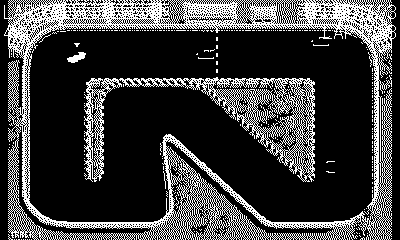

# Sprint

A top-down circuit racer for the Playdate, in the spirit of the arcade
*Super Sprint* design. You race one of eight single-screen tracks against
three AI drone cars over 3 or 5 laps. **The crank is your steering wheel**, **A**
is the throttle and **B** is the brake. Stay on the black road — clip a
wall and you scrub off speed.

## Controls

| Input | Action |
|---|---|
| Crank | Steer (the wheel) |
| Left / Right | Steer (full lock, fallback) |
| A | Accelerate |
| B | Brake / reverse |
| A (title) | Start the race |
| Left / Right (title) | Choose 3 or 5 laps |
| Up / Down (title) | Choose track (1–8) |

Your car is the solid white one with the bobbing caret over it; the
hollow cars are the drones. Best lap time is saved on the device.

## Origin and assets

This is an original Lua implementation — none of the PySprint code is
reused. The 1-bit track and the 16-angle car sprites are converted from
the artwork of [PySprint](https://github.com/salem-ok/PySprint) by
salem-ok, which is released under **CC0-1.0** (public domain). The
conversion is reproducible: `convert.py` reads a PySprint checkout
(`$PYSPRINT_SRC`, default `/tmp/pysprint_src`) and regenerates `images/`
and the per-track `trackN_data.lua` / `trackN_mask.lua` files for all
eight tracks.

PySprint runs in a 640×400 logical space; this port keeps its physics
and track data in that space and renders at 0.6 scale onto the 400×240
screen. Collision uses a baked drivable-area grid (from the track mask);
laps and standings use the track's gate midpoints as the racing line,
which is also the path the drones follow.

## Tracks

All eight PySprint tracks are wired up and selectable from the title
screen (Up / Down). Each is converted by `convert.py` from
`SuperSprintTrackN*` into `trackN.png` / `trackN_data.lua` /
`trackN_mask.lua`, carrying the track's name and difficulty. One known
limitation: tracks 2, 4, 6 and 8 also ship an `UpperMask` for bridges,
which this port does not yet model — cars take the lower deck throughout.
